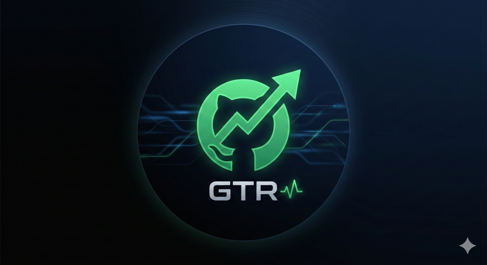

<p align="center">
  
</p>

<h1 align="center">GTR — GitHub Trending Repos</h1>

<p align="center">
  A cyberpunk-themed dashboard for discovering today's hottest GitHub repositories.
</p>

<p align="center">
  
  
  
  
  
</p>

<p align="center">
  
</p>

## What is this

A static website that displays GitHub trending repositories in real-time. Data is fetched live from the GitHub Trending API and presented in a filterable, searchable grid with a neon-green cyberpunk aesthetic. Zero build tools, zero frameworks — just HTML, CSS, and vanilla JS deployed on GitHub Pages.

## Live Demo

**[dadadadas111.github.io/github-trending-repos](https://dadadadas111.github.io/github-trending-repos/)**

## Features

- **Trending repos** — Daily, weekly, and monthly time ranges
- **Interactive hero** — Canvas particle network animation with mouse interaction and parallax scroll
- **Glitch title** — Scrambled typing effect + RGB-split CSS glitch animation
- **Filter & search** — Filter by programming language, search by repo name or description
- **Glassmorphism cards** — Responsive grid (1/2/3 columns) with hover glow effects and staggered entrance animations
- **Smart caching** — In-memory cache per time range, no redundant API calls
- **Skeleton loading** — Shimmer placeholders while data loads
- **Accessibility** — `prefers-reduced-motion` disables all animations, semantic HTML, ARIA labels
- **SEO-ready** — Open Graph, Twitter Cards, JSON-LD structured data, sitemap, robots.txt
- **Zero dependencies** — No frameworks, no build step, pure web fundamentals

## Tech Stack

| Layer | Tech |
|-------|------|
| Markup | HTML5 (semantic) |
| Styling | CSS3 — custom properties, glassmorphism, `@keyframes`, responsive grid |
| Logic | Vanilla JavaScript — Canvas 2D API, Fetch API, debounced search |
| Icons | [Phosphor Icons](https://phosphoricons.com/) |
| Fonts | [Rajdhani](https://fonts.google.com/specimen/Rajdhani) + [Chakra Petch](https://fonts.google.com/specimen/Chakra+Petch) |
| Hosting | GitHub Pages via GitHub Actions |

## Getting Started

```bash
git clone https://github.com/dadadadas111/github-trending-repos.git
cd github-trending-repos

# Open directly
open index.html

# Or use a local server
python3 -m http.server 8080
# → http://localhost:8080
```

## Deployment

Push to `main` → GitHub Actions automatically deploys to GitHub Pages.

**First-time setup:**
1. Go to repo **Settings → Pages**
2. Set Source to **GitHub Actions**
3. Push to `main` — the workflow handles the rest

## API

Uses [`githubtrending.lessx.xyz`](https://githubtrending.lessx.xyz/trending) — a free, no-auth API for GitHub trending data.

```
GET https://githubtrending.lessx.xyz/trending?since=daily
GET https://githubtrending.lessx.xyz/trending?since=weekly
GET https://githubtrending.lessx.xyz/trending?since=monthly
```

Returns an array of repos with `name`, `description`, `repository`, `language`, `stars`, `forks`, `increased`, and `builders`.

## License

MIT
